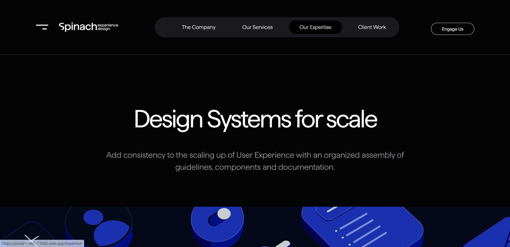
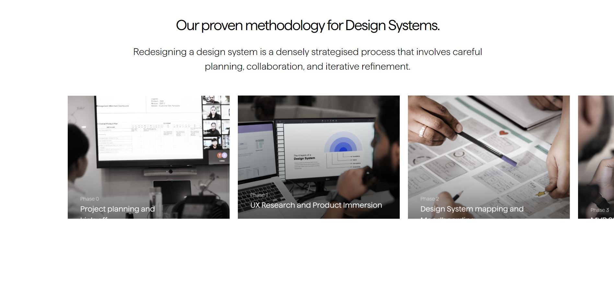
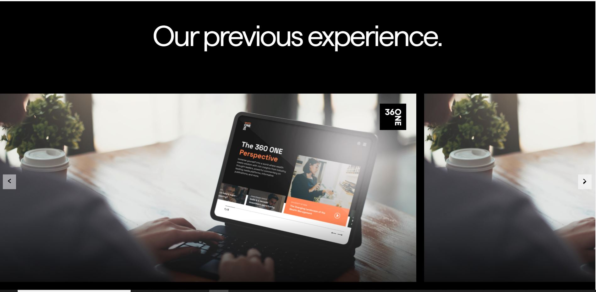
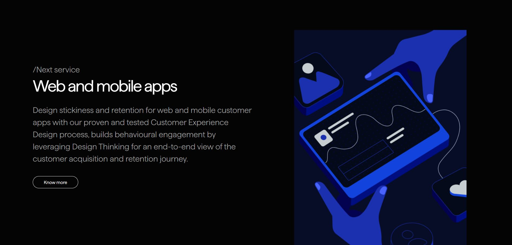

# Project Name

PixelPerfect UI

## Live Website

Add the live website link here: [Live Website](https://pixelperfect-71b82.web.app/)

## Folder Structure

1. Assets Folder: Contains all the images and other static assets used in the project.
2. Layouts Folder: Includes different layout components like containers, headers, footers, etc.
3. Components Folder: Contains reusable components like cards, carousels, buttons, etc.
4. Pages Folder: Includes individual page components like service page and other pages of your website.
5. Utils Folder: Contains utility functions, constants, or data used across the project.

## Scrrenshots






## Getting Started

To get a local copy up and running follow these simple steps.

### Prerequisites

- Node.js installed
- npm (Node Package Manager) installed

### Installation

1. Clone the repo
   ```sh
   git clone https://github.com/yourusername/your-repo.git
   ```
2. Install NPM packages

   ```sh
   npm install
   ```

3. Run the app in development mode
   ```sh
   npm start
   ```
4. Open http://localhost:3000 to view it in your browser.

### unit tests

1. written one Component Rendering Test to check the responsiveness of the header component at 390px,
2. to run test use below command
   ```sh
   npm test
   ```

```

## Recommendations

For a better user experience, use Firefox.
Make sure to test the responsiveness of website on different devices.
```
